# Data-Structures

### Linked List (List.cpp)
Created a Linked List object with functions such as insert, remove, reverse and print.
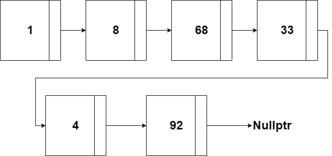
### Doubly Linked List (List.cpp)
Created Doubly Linked List, which is a Linked List with a previous pointer to each node and a tail node, to keep track of the end of the list.
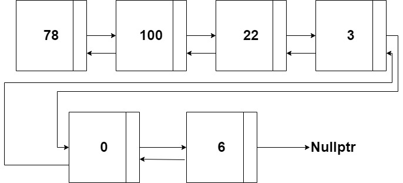
### Hash Table (Hash_Table.cpp)
A Hash Table is a data structure which uses a hash function to compute the index in which the element will be added into, in the array. The hash function used is the mod of the array size.
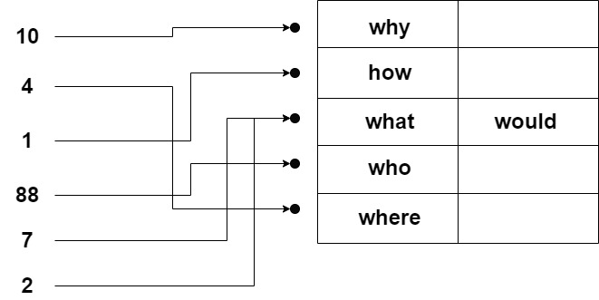
### Stack (Stack.cpp)
Linked List Stack implementation that includes the functions push, pop, print and top, using the last in, first out method.
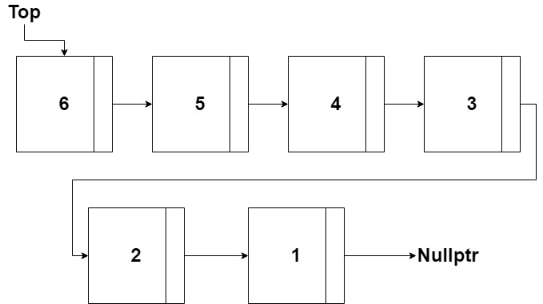
### Queue (Queue.cpp)
Linked List Queue implementation that includes the functions push, pop, print, front, and back, using the first in, first out method.
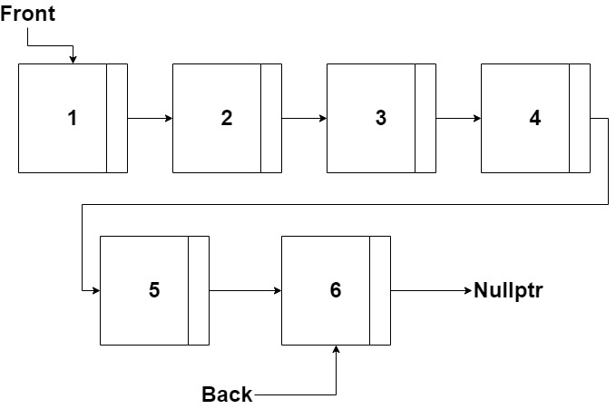
### Priority Queue (Queue.cpp)
Linked List Priority Queue implementation, prioritizing elements by a number that is checked and  includes the functions push, pop, print, front, and back, using the first in, first out method.
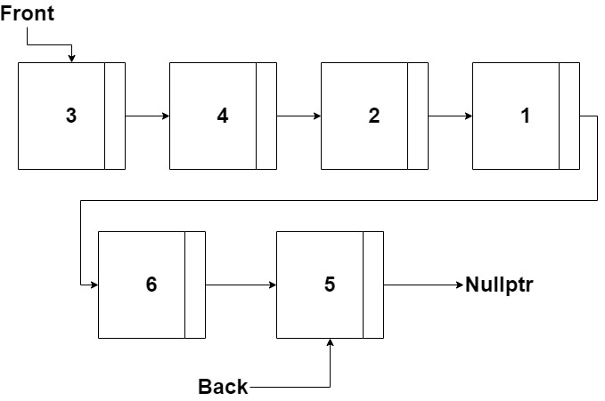
### Binary Tree (Tree.cpp)
Tree in which each node has 0 to 2 children and is implemented with nodes. Includes insert and remove functions, as well as look up and print recursive functions.
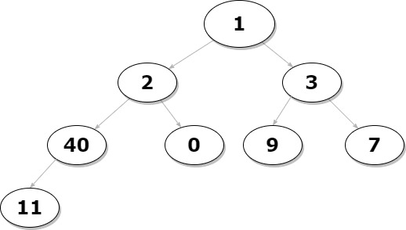
### Binary Search Tree (Tree.cpp)
Tree in which each node has 0 to 2 children and is implemented with nodes. The child on the left of a node is smaller than the current one and the child on the right is larger. Includes insert and remove functions, as well as look up and print recursive functions.
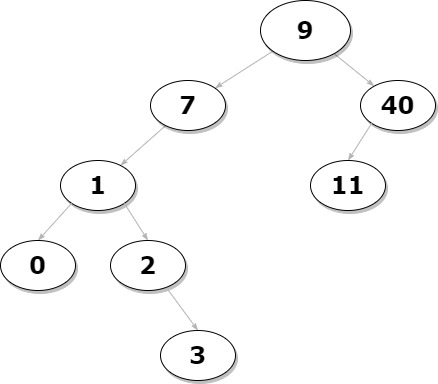
### Trie (Tree.cpp)
Tree object that is used to insert words, where the root is empty. Each node has a bool to check if the word is complete and a hash map of children, mapping the characters onto the nodes.
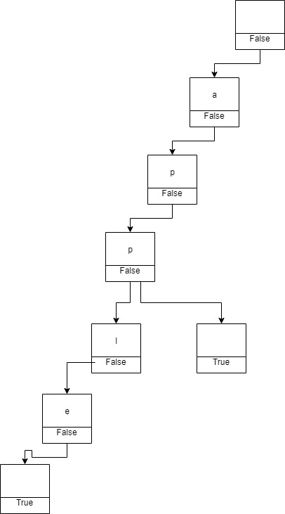
### Matrix Graph (Graph.cpp)
Graph represented with a vertex by vertex matrix. An edge between vertex a and b is represented by a 1 in the matrix, matrix[a][b] = 1.
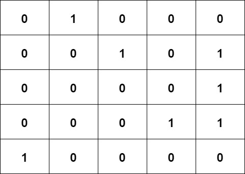
### Adjacency List Graph (Graph.cpp)
Graph represent with an adjacency list which is implemented with a vector of Vertex objects. Each Vertex object has a vector for it's adjacent vertices and its own data (Arrows in diagram represent object's array).
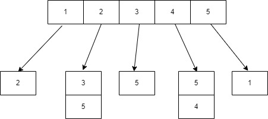
### Min Heap (Heap.cpp)
Binary tree heap implementation that keeps track of the minimum value at the root. Each node is smaller than the nodes below and the tree is kept with heapify functions.
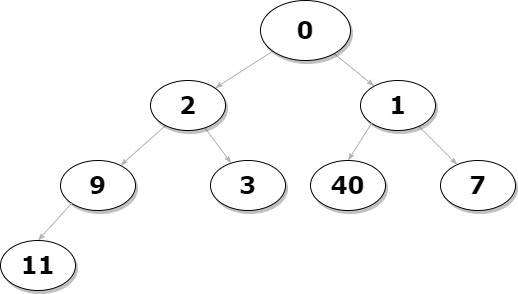
### Max Heap (Heap.cpp)
Binary tree heap implementation that keeps track of the maximum value at the root. Each node is larger than the nodes below and the tree is kept with heapify functions.
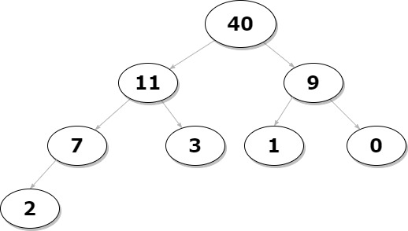
### Resources
[What are Hash Functions and How to choose a good Hash](https://www.geeksforgeeks.org/what-are-hash-functions-and-how-to-choose-a-good-hash-function/)

[Hash Table](https://www.programiz.com/dsa/hash-table)

[Binary Search Tree | Set 2 (Delete)](https://www.geeksforgeeks.org/binary-search-tree-set-2-delete/)

[Trie Data Structure Implementation (LeetCode)](https://www.youtube.com/watch?v=giiaIofn31A&ab_channel=MichaelMuinos)

[Graph and its representations](https://www.geeksforgeeks.org/graph-and-its-representations/)
